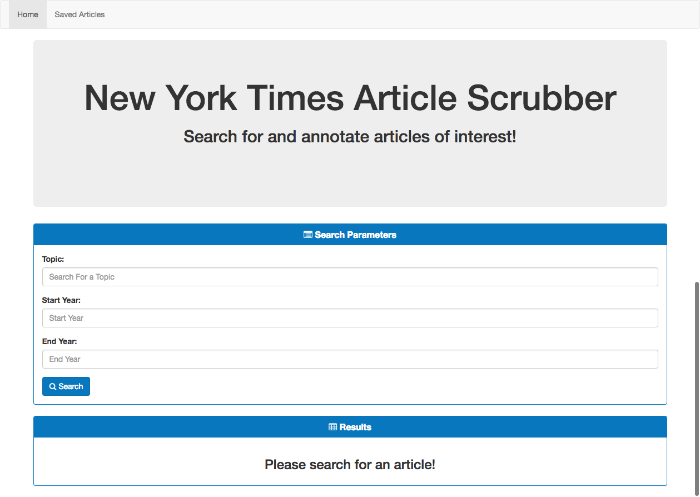
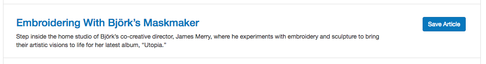

# New York Times Article Search

A web application that allows you to search and save articles from [The New York Times](https://www.nytimes.com/).

## Description

This is a full stack web application built with React and is powered by Node and Express. This application uses the New York Times API to search for articles within a certain publication date range. When results are populated, a user can save an article to MongoDB database, which is rendered on the Saved Articles page. Saved articles may be deleted as well. 

## Getting Started

### Live Example

[https://secure-plateau-33675.herokuapp.com/](https://secure-plateau-33675.herokuapp.com/)

> Since the app is hosted on a free [Heroku](https://www.heroku.com/) instance, it may need some time to boot up.


## Using New York Times Article Search

1. To start using the CoS Scraper, navigate to [https://secure-plateau-33675.herokuapp.com/](https://secure-plateau-33675.herokuapp.com/)

	
	
2. Enter a topic you wish to search for. Add a start year and end year for the articles you wish to find. Click ```Search``` to find articles. 

	
	
3. If you see an article that you would like to save, click ```Save Article```. You will now by able to view this article on the Saved Articles page.

	
	
4. To view saved articles, head to the Saved Articles page via the navigation bar. You may delete an article you no longer want saved by clicking ```Delete Article```.
 
	

## Deployment
You can easily deploy this application to a platform such as Heroku. You will need to have MongoDB installed via an add-on such as mLab. When deploying, deploy the ```nytreactsearch``` directory only.

## Built With

* [React](https://reactjs.org/) - JavaScript library for building user interfaces
* [Node.js](https://nodejs.org/) - JavaScript run-time environment
* [Express](https://expressjs.com/) - Node.js web application framework
* [MongoDB](https://www.mongodb.com/) - NoSQL database program
* [Mongoose](http://mongoosejs.com/) - MongoDB object modeling tool 

## Author

* **Justin Smith**


